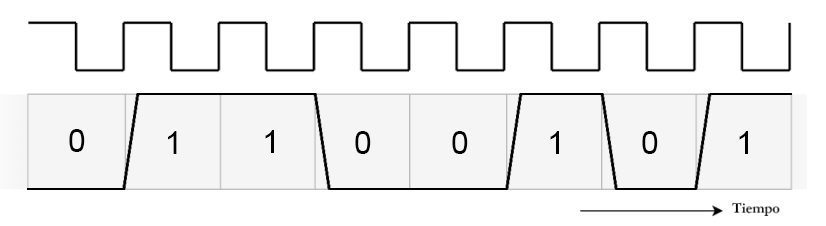
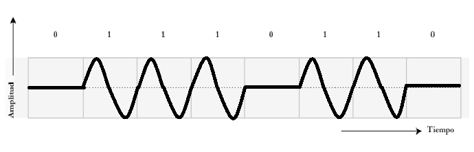
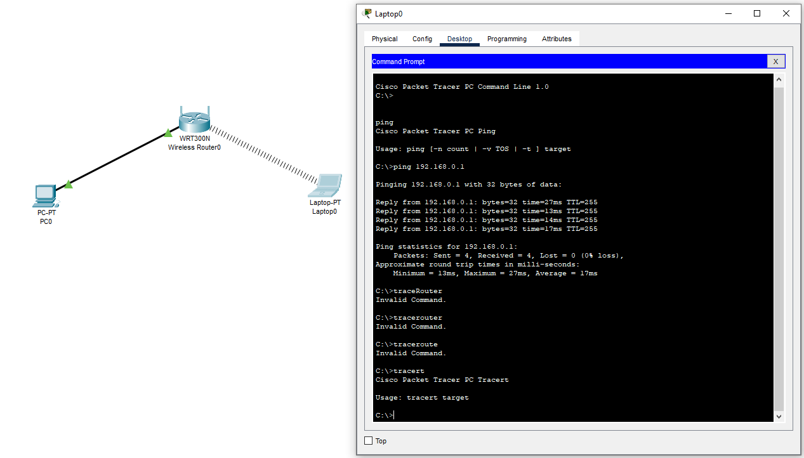
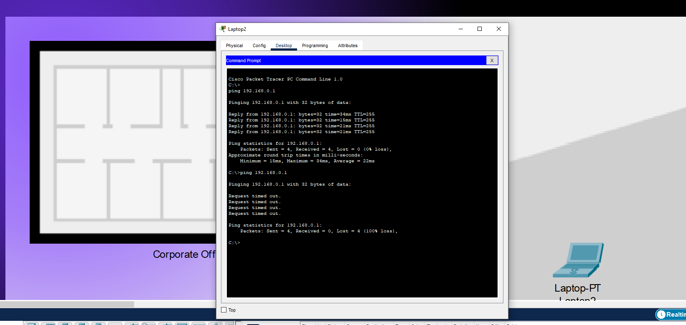

# TRABAJO PRÁCTICO 1 - Repaso de fundamentos esenciales e introducción a Packet Tracer

## Nombres

- **Dante Augsburger**
- **Martino Fioramonti**
- **Tadeo Antonino**
- **Ignacio Quintana**

- **Latency Killers**

- **Universidad Nacional de Córdoba**
- **Comunicaciones de Datos**
- **Santiago M. Henn**
- **Facundo Oliva Cuneo**
- **25/08/2025**

### Información de los autores

- **_dante.augsburger@mi.unc.edu.ar_**
- **_martino.fioramonti@mi.unc.edu.ar_**
- **_tadeo.antonino@mi.unc.edu.ar_**
- **_ignacio.agustin.quintana@mi.unc.edu.ar_**

---

## Resumen

En este trabajo se repasaron conceptos fundamentales de \*comunicaciones de datos, como ondas electromagnéticas, atenuación, transmisión digital y técnicas de modulación. Además, se aplicaron estos conocimientos en una práctica con **Packet Tracer**, donde se configuró una red inalámbrica, se analizaron las frecuencias de operación y el alcance de la señal, y se evaluó cómo factores como la distancia y los obstáculos afectan la conectividad. Esto permitió relacionar la teoría con situaciones reales y comprender mejor el funcionamiento de las redes y la transmisión de datos.

Palabras clave: Ondas electromagnéticas, Modulación digital, Atenuación, Packet Tracer.

---

## Introducción

Se estudian conceptos como ondas electromagnéticas, señales continuas y discretas, y las técnicas de modulación y demodulación que permiten transmitir información a través de distintos medios.
Se aborda la representación de la información digital, la transmisión mediante interfaces simples como UART, y las implicancias del uso de diferentes esquemas de modulación digital, evaluando su desempeño en términos de confiabilidad y tasa de error de bit.
Finalmente, se realiza una práctica en el simulador Packet Tracer para configurar una red inalámbrica básica, interconectar dispositivos y analizar el alcance y las características de la señal. Esto permite vincular la teoría con escenarios concretos de redes de datos y comprender mejor la relación entre la capa física y el transporte de información.

---

## Marco Teórico

Se repasaron conceptos fundamentales de las **comunicaciones de datos** que sirven como base para el trabajo práctico:

- **Ondas electromagnéticas**: su propagación, longitud de onda y frecuencia, así como la relación con la velocidad de la luz.
- **Atenuación y pérdidas**: disminución de la señal al propagarse, efectos de la distancia, los obstáculos y fenómenos como el _fading_.
- **Señales digitales**: transmisión serie, diferencias entre comunicación síncrona y asíncrona, y codificación binaria.
- **Modulación digital**: técnicas como ASK, FSK, PSK y QAM, con sus ventajas y limitaciones en términos de confiabilidad (BER) y eficiencia espectral.
- **Redes inalámbricas**: bandas de frecuencia de uso común (2,4 GHz y 5 GHz), su alcance y limitaciones en entornos reales.

---

## Modelo

El trabajo práctico se basó en un **modelo simplificado** de red de comunicaciones:

- Representación de una transmisión digital sobre un canal.
- Uso de una señal portadora modulada en amplitud (ASK) para ilustrar esquemas básicos de modulación.
- Simulación en **Packet Tracer** de una red WiFi básica, como modelo reducido de lo que ocurre en entornos reales.
- Análisis del alcance, la atenuación y la conectividad como factores centrales en el desempeño de la red.

---

## Metodología

Para llevar a cabo el trabajo se siguió la siguiente secuencia:

1. **Cálculo de parámetros de onda**: frecuencia, longitud de onda y ubicación en el espectro electromagnético.
2. **Análisis de señales digitales**: conversión de caracteres a código ASCII/binario y estudio de la transmisión serie.
3. **Identificación de técnicas de modulación digital**: representación de ASK y comparación con FSK, PSK y QAM.
4. **Configuración de la red en Packet Tracer**: conexión inalámbrica entre router y notebook.
5. **Verificación de la conectividad**: pruebas de ping, movimiento de dispositivos y pérdida de señal fuera del alcance en el entorno de Packet Tracer.

---

### Actividad 1

Se puede observar del grafico que la onda completa un ciclo cada 60mm = 0,06m. Es decir que la longitud de onda es:

$λ=0,06m$

La frecuencia considerando que viaja a la velocidad de la luz($c=3.10^8 m/s$):

$f= \frac{c}{λ} = \frac{3.10^8}{0,06} = 5 GHz$

Según la ITU(Unión internacional de telecomunicaciones), esta onda está en:

> La region de microondas que va de 300MHz a 300GHz

> La banda SHF (Ultra alta frecuencia) que va de 3GHz a 30GHz

Algunos dispositivos que operan en esta banda son:

- Redes WiFi(2,4GHz y 5GHz)
- Sistemas de radar
- Comunicación satelital

La línea de trazos roja en la figura de la onda representa la atenuación de la señal electromagnética a medida que se propaga en el espacio, La intensidad disminuye con la distancia debido a pérdidas en el medio.

Poniendo como ejemplo las redes WiFi, sí se ve afectada por la atenuacion de la señal a medida que se propaga en el espacio. El WiFi a 5GHz tiene un alcance menor que a 2,4GHz porque se atenua más rápido. En la vida cotidiana es común notar que el WiFi 5GHz tiene buena velocidad cerca del router, pero a medida que te vas alejando pierde cobertura.

Como afecta a diferentes sistemas:

- Telefonía celular: Sí se ve afectada por la atenuacion y fenomenos como el fading(variación de la atenuación de la señal en función de variables como el tiempo, la posición geográfica y la radiofrecuencia)
- Cable coaxial: Mucho menos afectado, porque la señal viaja confinada en un medio físico.
- Fibra óptica: No, porque la transmisión se realiza con pulsos de luz confinados en el núcleo de la fibra.

### Actividad 2

### Señales digitales

Se quiere representar una transimisión serie, los bits se transmiten bit a bit a través de un único canal de comunicación. Es síncronica ya que se observa una señal de reloj compartida que coordina al transmisor y al receptor. La transmisión de bits se da en una sola dirección en ese instante.

No, no es el mejor paradigma si busco transimitir datos de forma bidireccional. En cuanto a la rapidez sí, porque es síncrono y no necesita bits de inicio/parada como una comunicacion asíncrona. Y en cuanto a la comunicación bidireccional sería mejor implementar dos canales separados para poder transimitir y recibir datos simultáneamente.

Tomando nuestro nombre de grupo: Latency Killers

- La cuarta letra es: "e"

- Identificando la letra "e" en codigo ASCII: 101

- Conviertiendo 101 a binario: 01100101

Dada la pendiente en los niveles de tensión que se observan en el gráfico dados en el TP, la forma correcta de medir
es **en el centro de cada intervalo de bit**.

- Si se midiera en los bordes (donde ocurre la transición), podría haber dudas por ruido o por la propia pendiente.
- En cambio, en el punto medio de cada celda temporal el nivel ya está estabilizado en 0 o 1, lo cual garantiza una lectura confiable.

### Actividad 3

La técnica de modulación que se observa en el gráfico dado es **ASK (Amplitude Shift Keying)**,
también conocida como **modulación por desplazamiento de amplitud**.  
En este esquema, la amplitud de la portadora cambia en función de si el bit transmitido es 0 o 1.

La siguiente figura muestra cómo se vería la señal digital modulada en **ASK** para la secuencia binaria dada.  
Se observa que, en los intervalos donde el bit es “1”, aparece una portadora sinusoidal con amplitud constante,
mientras que en los intervalos donde el bit es “0” la portadora se apaga y la señal permanece en reposo.

Otras técnicas de modulación basadas en los mismos principios son:

- **FSK (Frequency Shift Keying)**: varía la frecuencia de la portadora según el bit.
- **PSK (Phase Shift Keying)**: varía la fase de la portadora según el bit.
- **QAM (Quadrature Amplitude Modulation)**: combina variaciones de amplitud y fase para transmitir más bits por símbolo.

El **Bit Error Rate (BER)** es la tasa de error de bits, definida como la razón entre el número de bits
recibidos erróneamente y el número total de bits transmitidos.  
Es una medida de la confiabilidad del sistema de comunicación.

En términos de BER:

- **ASK** es la más sensible al ruido, ya que las variaciones de amplitud son muy vulnerables a interferencias.
- **FSK** mejora el desempeño, porque la frecuencia es más fácil de discriminar que la amplitud en entornos ruidosos.
- **PSK** suele tener aún mejor BER en condiciones de ruido moderado.
- **QAM**, al transmitir más información por símbolo, puede aumentar la eficiencia espectral, pero también se vuelve más sensible al ruido a medida que crece el número de niveles.

En general, **PSK y FSK** ofrecen mejores prestaciones que ASK en términos de BER para canales ruidosos.

### Actividad 4

El router configurado opera a una frecuencia de 2,437 GHz, la cual corresponde a la región del espectro electromagnético de las microondas, dentro de la banda ISM de 2,4 GHz. Este rango de frecuencias es ampliamente utilizado en aplicaciones de comunicación inalámbrica, ya que no requiere licencia y permite la implementación de redes WiFi domésticas y empresariales.

Para verificar el correcto funcionamiento de la red, primero se conectó una notebook al router y se comprobó la conectividad mediante la ejecución de un ping, como se muestra en la siguiente imagen:

Posteriormente, se analizó el efecto de la distancia en la señal. Al mover la notebook fuera de los límites de cobertura de la red, se observó la pérdida de conectividad, lo que refleja en el simulador el mismo comportamiento que ocurre en un entorno real: la señal se atenúa progresivamente hasta volverse insuficiente para mantener la comunicación.

