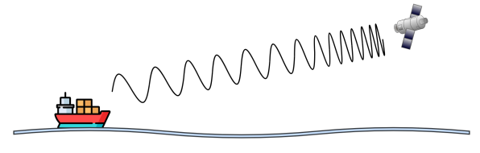
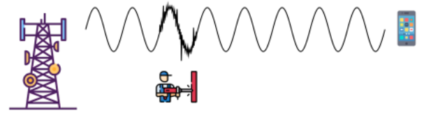

# TRABAJO PRÁCTICO N°2

## Universidad Nacional de Córdoba  
**Carrera:** Ingeniería en Computación  
**Cátedra:** Comunicaciones de Datos  
**Docentes:** Santiago M. Henn — Facundo Oliva Cuneo  
**Fecha de entrega:** 08/09/2025  

---

## Integrantes (Grupo *Latency Killers*)

- **Dante Augsburger**  
  📧 *dante.augsburger@mi.unc.edu.ar*  
- **Martino Fioramonti**  
  📧 *martino.fioramonti@mi.unc.edu.ar*  
- **Tadeo Antonino**  
  📧 *tadeo.antonino@mi.unc.edu.ar*  
- **Ignacio Quintana**  
  📧 *ignacio.agustin.quintana@mi.unc.edu.ar*  

---

## Resumen

Se revisan conceptos de la capa física y de enlace de datos, analizando fenómenos como atenuación, ruido y SNR, y su efecto en distintas transmisiones. Se utilizó Wireshark para capturar y examinar tramas, identificando direcciones IP y MAC, y comprendiendo la estructura de Ethernet y los cables UTP. Por último se elaboraron conclusiones sobre la privacidad en redes, la trazabilidad de las direcciones MAC y la relación con el IMEI y el uso de VPNs.

Palabras clave: capa física, capa de enlace de datos, Ethernet, Wireshark, direcciones MAC, privacidad en redes.

---

## Introducción

Las comunicaciones digitales se sostienen sobre la interacción entre fenómenos físicos y protocolos de enlace que garantizan la transmisión confiable de datos. Factores como la atenuación, el ruido y la relación señal-ruido influyen directamente en la calidad de las señales, mientras que protocolos como Ethernet y el uso de cables UTP permiten estructurar y transportar la información de manera eficiente. Herramientas de análisis como Wireshark hacen posible observar en detalle este intercambio, capturando tramas y evidenciando la importancia de las direcciones IP y MAC en la red. Todo esto permite integrar los conceptos teóricos con la práctica y comprender mejor el funcionamiento de las redes modernas.

---

## Consigna 1

### a) ¿Qué fenómeno muestra la figura?

La figura representa la propagación de una onda electromagnética desde un barco hacia un satélite. Este fenómeno permite transmitir información a través del espacio sin necesidad de cables, utilizando ondas de radio que viajan por el aire o el vacío.  

**Características principales:**
- **Atenuación por distancia:** A medida que la onda se aleja del transmisor, su intensidad disminuye. Esto se debe a la dispersión de energía en el espacio y a la absorción por el medio (atmósfera, humedad, etc.). 
- **Interacción con el entorno:** Aunque en la figura se muestra una trayectoria directa, en la realidad pueden intervenir fenómenos como:  
  - **Reflexión:** Las ondas pueden rebotar en superficies como el mar, generando trayectorias múltiples.

  - **Refracción:** Cambios en la densidad del aire (por temperatura o humedad) pueden desviar la trayectoria.

  - **Difracción:** En frecuencias bajas, las ondas pueden rodear obstáculos o curvarse ligeramente por el horizonte.

  - **Multipath:** Cuando la señal llega por varios caminos (directo y reflejado), puede causar interferencias o errores de sincronización.
- **Propagación por línea de vista:** La comunicación entre el barco y el satélite requiere que no haya obstáculos entre ambos. Las ondas electromagnéticas, especialmente en frecuencias altas (como microondas), se propagan en línea recta y son sensibles a obstrucciones.

---

### b) ¿A qué transmisiones afecta más? ¿Cuáles son más resilientes?
El fenómeno de propagación electromagnética incluyendo atenuación, reflexión, refracción, difracción y multipath afecta de manera diferente según el tipo de transmisión y la frecuencia utilizada.
- **Más afectados:**  
  - Comunicaciones inalámbricas de largo alcance en HF/VHF/UHF, donde la propagación depende mucho del entorno.  
  - En bandas altas (GHz), como Wi-Fi o satélites, que necesitan línea de vista ya que son muy sensibles a la atenuación, obstáculos físicos y condiciones atmosféricas. Ejemplos: Wi-Fi (2.4 GHz / 5 GHz), enlaces satelitales, 4G/5G.
  - Situaciones con multipath (rebotes en edificios o en el mar) que generan interferencias entre copias de la misma señal.  

- **Más resilientes:**  
  - La fibra óptica, que transmite señales mediante pulsos de luz dentro de un cable de vidrio o plástico. Inmune a interferencias electromagnéticas, atenuación atmosférica y fenómenos de propagación. Es Ideal para enlaces de alta velocidad y larga distancia.
  - El cable coaxial, usados en redes LAN y televisión por cable ofrecen buena protección contra el ruido externo gracias a su blindaje o trenzado. Aunque tienen limitaciones de distancia, son muy estables en entornos controlados.
  - Los sistemas satelitales modernos con corrección de errores y modulaciones adaptativas, que compensan pérdidas.  

---

### c) ¿Por qué no se debe encender el celular en un avión? ¿Se relaciona con este fenómeno?
Sí, está relacionado:  
- Los dispositivos móviles emiten ondas de radio que pueden interferir con los sistemas de comunicación y navegación del avión, sobre todo en fases críticas (despegue y aterrizaje). Múltiples dispositivos generando señales pueden provocar ruido adicional en las bandas de comunicación del avión
- Además, dentro de un avión metálico, la señal rebota (multipath) y se vuelve menos predecible.  

Actualmente, algunas aerolíneas permiten usar Wi-Fi o telefonía, pero a través de sistemas internos del avión que canalizan la comunicación de forma controlada hacia satélites, evitando interferencias.

---

# Consigna 2

### a) ¿Qué fenómeno muestra la figura? ¿Cuáles son sus características?

La figura muestra interferencia electromagnética o ruido en la señal. La antena transmite una onda “limpia”, pero un equipo eléctrico (taladro) irradia picos de ruido y distorsiona un tramo de la señal. Luego, al cesar la fuente, la señal vuelve a recibirse “normal”.

**Características principales:**
- **Momentáneo:** aparece en ráfagas cuando arranca o conmuta un aparato.
- **No deseado:** no forma parte del mensaje, se superpone a la señal útil.
- **De amplio espectro:** muchos equipos eléctricos emiten en varias frecuencias, pueden afectar distintos sistemas.
- **Radiado o acoplado:** puede viajar por el aire (radiado) o meterse a través de cables cercanos (acoplamiento).
- **Deforma la onda:** altera amplitud/fase en ese tramo.
- **Baja la SNR localmente:** mientras dura el pulso, cae la relación señal-ruido y suben los errores.
- **Depende de potencia y cercanía:** cuanto más cerca y potente el equipo ruidoso, peor el efecto.
- **Más evidente en inalámbrico:** al no haber blindaje físico, el receptor “escucha” todo lo que hay en el aire.

---

### b) ¿A qué transmisiones afecta más? ¿Cuáles son más resilientes?
**Más afectados:**
- **Enlaces inalámbricos** (celular, Wi-Fi, radio) que comparten el aire con otras fuentes, en bandas congestionadas como 2.4 GHz el riesgo de choques es mayor.
- **Modulaciones de alto orden** (p. ej., 64/256-QAM): son eficientes pero exigen SNR alta, el ruido impulsivo las rompe fácil.
- **Cobre mal tendido o sin blindaje** (UTP cerca de motores/fuentes): capta EMI (interferencia electromagnetica) y sufre diafonía si corre en paralelo con otros cables.
- **Sistemas sin corrección de errores** o sin interleaving: el ruido impulsivo produce errores en ráfaga difíciles de recuperar.

**Más resilientes:**
- Fibra óptica: inmune a la interferencia electromagnética del entorno.
- Coaxial blindado y par trenzado de calidad (buen trenzado/puesta a tierra): reducen el acoplamiento de ruido.
- Bandas menos saturadas (p. ej., 5 GHz frente a 2.4 GHz) y enlaces con línea de vista clara.
- Modulaciones más robustas (BPSK/QPSK) o OFDM con FEC (corrección de errores) y interleaving: toleran mejor SNR baja y errores en ráfaga.
- MIMO/diversidad: combinan varias trayectorias/antenas para “ganarle” a desvanecimientos e interferencias puntuales.

---

### c) ¿Qué es la SNR? ¿Se relaciona con la BER del TP01?
La SNR es la relación entre la potencia de la señal útil y la potencia del ruido presente en el canal. Se expresa comúnmente en decibelios (dB) y constituye un indicador directo de la calidad de la transmisión. 
- Cuanto mayor sea la SNR, más fácil resulta para el receptor distinguir la señal original del ruido.
- Mientras que una SNR baja implica que el ruido compite en magnitud con la señal, dificultando la correcta interpretación de la información.

Este concepto se relaciona estrechamente con el BER (Bit Error Rate), ya que:
- Un canal con buena SNR tenderá a presentar una tasa de errores baja.
- Mientras que un canal con SNR deficiente aumentará significativamente la probabilidad de errores en la decodificación.

# Consigna 4
### a) Privacidad de un dispositivo en la red y la trazabilidad de una dirección MAC

### b) Investigar que es el IMEI y qué similitud tiene con la dirección MAC
El IMEI (International Mobile Equipment Identity) es un número único que identifica a cada dispositivo móvil a nivel mundial. Está grabado de fábrica en el hardware del teléfono y permite a las operadoras reconocer el equipo en la red celular, independientemente de la tarjeta SIM utilizada. Entre otras funciones, sirve para bloquear un dispositivo robado e impedir que acceda a la red.

Tanto el IMEI como la dirección MAC son identificadores únicos y permanentes asociados al hardware del dispositivo, lo que los hace trazables. El IMEI identifica el equipo en la red móvil y la MAC en la red de datos.

### c) ¿Una VPN oculta la dirección MAC del dispositivo?
Una VPN no oculta la dirección MAC del dispositivo, solo la IP pública y el contenido del tráfico. La MAC es un identificador que se usa únicamente dentro de la red local (capa 2) y es visible para el router y otros equipos de la misma LAN. Al salir a internet, la MAC se descarta y se reemplaza por la IP pública, por lo que los servidores externos nunca llegan a verla.

---

# Conclusión
Se afianzaron conceptos fundamentales de la capa física y de la capa de enlace de datos, analizando fenómenos como atenuación, interferencia, ruido e impacto de la relación señal-ruido sobre la calidad de la transmisión. A través del uso de Wireshark se logró observar de manera práctica cómo se estructuran y circulan las tramas en la red, identificando direcciones IP y MAC, y comprendiendo la importancia de estos identificadores en términos de funcionamiento y privacidad. Se investigó acerca de que la MAC y el IMEI son identificadores únicos y trazables, y que una VPN no oculta la MAC, ya que solo es visible en la red local.

# Bibliografía
https://wi-fiplanet.com/does-a-vpn-app-help-hide-my-devices-mac-address/
https://es.wikipedia.org/wiki/IMEI