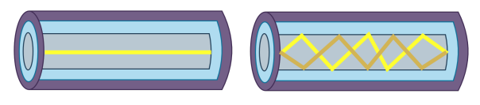
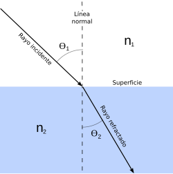
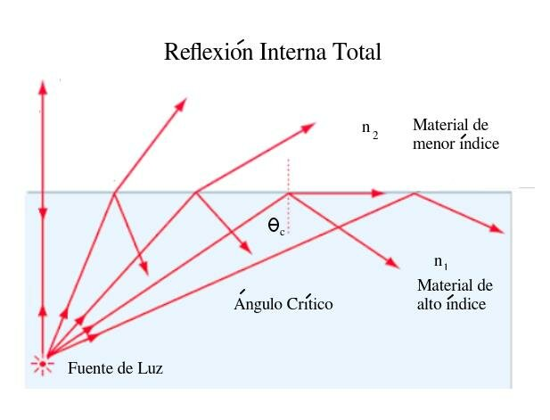

# TRABAJO PRÁCTICO N°3

  
## Universidad Nacional de Córdoba

**Carrera:** Ingeniería en Computación

**Cátedra:** Comunicaciones de Datos

**Docentes:** Santiago M. Henn — Facundo Oliva Cuneo

**Fecha de entrega:** 22/09/2025

---

## Integrantes (Grupo *Latency Killers*)

  

-  **Dante Augsburger**

📧 *dante.augsburger@mi.unc.edu.ar*

-  **Martino Fioramonti**

📧 *martino.fioramonti@mi.unc.edu.ar*

-  **Tadeo Antonino**

📧 *tadeo.antonino@mi.unc.edu.ar*

-  **Ignacio Quintana**

📧 *ignacio.agustin.quintana@mi.unc.edu.ar*

---

## Resumen

En este trabajo se estudian las capas de acceso en redes locales y los principales protocolos asociados, con énfasis en los estándares IEEE 802.3 y 802.11. Se comparan diferentes medios de transmisión, tecnologías inalámbricas aplicadas a IoT y su relación con seguridad y compatibilidad. Se analizan las soluciones actuales para brindar conectividad en aviones en vuelo como parte del estado del arte en comunicaciones de datos.

Palabras clave: IEEE 802.3, IEEE 802.11, Wi-Fi, fibra óptica, protocolos inalámbricos, IoT, comunicaciones en vuelo.

---

## Introducción

---

  

## Consigna 1

### a) IEEE 802.3 y IEEE 802.11

Estandares de

---

## Consigna 2

### a) ¿Qué tipos de transmisión se están ilustrando? ¿Cuáles son sus características principales y en qué se diferencian una de otra? ¿Cuál es más costosa de implementar?

La ilustración de la izquierda representa la **fibra óptica monomodo**. Se caracteriza por tener un núcleo muy reducido, de apenas unos 8 a 9,5 micrómetros de diámetro. Gracias a este tamaño tan pequeño, solo permite la propagación de un único haz de luz. Al evitarse la dispersión modal, la señal mantiene su forma a lo largo de trayectos extensos, con muy poca pérdida y prácticamente sin distorsión. Por esta razón, es la opción más adecuada cuando se buscan comunicaciones a gran distancia, donde resulta clave conservar la calidad de la señal y minimizar la atenuación.

La ilustración de la izquierda, en cambio, representa la **fibra óptica multimodal**. Se caracteriza por tener un núcleo más amplio, generalmente de 50 o 62,5 micrómetros, lo que permite que la luz se propague por distintas trayectorias dentro de la fibra, en múltiples modos simultáneos. Al viajar varios modos de manera simultánea, mayor es la probabildad de que algunos llegan antes que otros al receptor, produciendo lo que se conoce como dispersión modal. Este fenómeno introduce distorsión y reduce la distancia máxima de transmisión sin pérdidas significativas de calidad. Según el tipo de la fibra multimodo (OM1 a OM5), varía la cantidad de modos que pueden circular y la optimización para diferentes usos, desde enlaces sencillos hasta aplicaciones de mayor exigencia en velocidad y eficiencia.

Entre ambas, la fibra óptica monomodo resulta más costosa de implementar. Esto se debe a que utiliza emisores láser de alta precisión en lugar de LEDs, además de requerir conectores y empalmes mucho más precisos debido al diámetro reducido de su núcleo. La instalación y el mantenimiento también son más delicados, lo que incrementa los costos. En cambio, la fibra multimodo es más económica, ya que admite fuentes de luz más simples, como LED, y tolera mayor flexibilidad en la conexión, lo que la hace más accesible para aplicaciones de corta distancia.

### b) ¿Qué es la Ley de Snell? ¿Cómo se relaciona con las transmisiones en Fibra Óptica y sus distintos modos?

La **ley de Snell** describe la relación entre los ángulos de incidencia y refracción cuando un rayo de luz atraviesa la frontera entre dos medios diferentes. Se expresa matemáticamente como:
-  n₁sin(θ₁) = n₂sin(θ₂)

donde n es el índice de refracción de cada medio y θ son los ángulos.

Para comprender su relación con la fibra óptica, se debe explicar el fenómeno de **reflexión interna total**. Este fenómeno físico ocurre cuando un rayo de luz que pasa de un medio más denso a otro menos denso incide sobre la frontera con un ángulo mayor al ángulo crítico. En esas condiciones, la luz no atraviesa la interfaz, sino que se refleja completamente hacia el primer medio.

Este principio es fundamental en el diseño de fibras ópticas, ya que garantiza que la señal luminosa permanezca confinada dentro del núcleo y pueda transmitirse a lo largo de grandes distancias con mínima pérdida.

### c) ¿Qué relación podés encontrar entre las conexiones inalámbricas y las transmisiones en Fibra Óptica?

Podemos encontrar que ambas transmiten información mediante ondas electromagnéticas (radiofrecuencia en el aire, luz guiada en la fibra óptica). Además, comparten fenómenos como atenuación, dispersión e interferencias, aunque se manifiestan de forma distinta.

La **fibra óptica** ofrece:

- Mayor ancho de banda.

- Menor latencia.

- Alta inmunidad a interferencias electromagnéticas.

- Adecuada para largas distancias.

Las **conexiones inalámbricas** aportan:

- Movilidad y flexibilidad.

- Fácil despliegue y menor costo inicial.

- Menor velocidad y estabilidad frente a la fibra.

Son tecnologías complementarias: la fibra constituye la infraestructura de alta capacidad y las redes inalámbricas acercan el acceso a los usuarios finales.

---

## Consigna 3

---

## Consigna 4

---

# Conclusión

Se afianzaron conceptos fundamentales de la capa física y de la capa de enlace de datos, analizando fenómenos como atenuación, interferencia, ruido e impacto de la relación señal-ruido sobre la calidad de la transmisión. A través del uso de Wireshark se logró observar de manera práctica cómo se estructuran y circulan las tramas en la red, identificando direcciones IP y MAC, y comprendiendo la importancia de estos identificadores en términos de funcionamiento y privacidad. Se investigó acerca de que la MAC y el IMEI son identificadores únicos y trazables, y que una VPN no oculta la MAC, ya que solo es visible en la red local.

  
  
  

# Bibliografía

https://www.glctec.com/fibra-optica-monomodo-y-multimodo-diferencias-clave-especificaciones-tecnicas-y-como-elegir-la-ideal-para-tu-red--news--8-1033-imp

https://www.tme.com/ar/es/news/library-articles/page/62274/el-principio-de-funcionamiento-de-la-fibra-optica-o-la-ley-de-snell-en-la-practica/