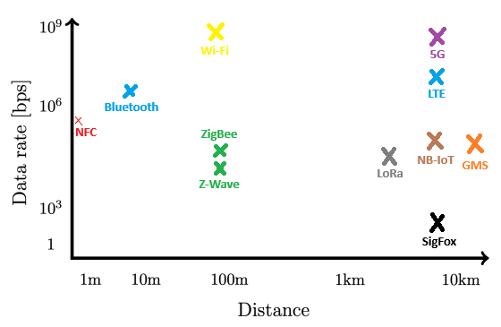

# TRABAJO PRÁCTICO N°3

  
## Universidad Nacional de Córdoba

**Carrera:** Ingeniería en Computación

**Cátedra:** Comunicaciones de Datos

**Docentes:** Santiago M. Henn — Facundo Oliva Cuneo

**Fecha de entrega:** 22/09/2025

---

## Integrantes (Grupo *Latency Killers*)

  

-  **Dante Augsburger**

📧 *dante.augsburger@mi.unc.edu.ar*

-  **Martino Fioramonti**

📧 *martino.fioramonti@mi.unc.edu.ar*

-  **Tadeo Antonino**

📧 *tadeo.antonino@mi.unc.edu.ar*

-  **Ignacio Quintana**

📧 *ignacio.agustin.quintana@mi.unc.edu.ar*

---

## Resumen

En este trabajo se estudian las capas de acceso en redes locales y los principales protocolos asociados, con énfasis en los estándares IEEE 802.3 y 802.11. Se comparan diferentes medios de transmisión, tecnologías inalámbricas aplicadas a IoT y su relación con seguridad y compatibilidad. Se analizan las soluciones actuales para brindar conectividad en aviones en vuelo como parte del estado del arte en comunicaciones de datos.

Palabras clave: IEEE 802.3, IEEE 802.11, Wi-Fi, fibra óptica, protocolos inalámbricos, IoT, comunicaciones en vuelo.

---

## Introducción

---

  

## Consigna 1

## a) Estándares IEEE 802.3 y 802.11

- **IEEE 802.3 (Ethernet):**
  - **Historia:** Publicado en 1983, define las redes cableadas Ethernet.
  - **Campo de aplicación:** LAN cableadas. Usa tramas de datos sobre cable coaxial, par trenzado o fibra óptica.
  - **Velocidades:** Desde 10 Mbps (Ethernet clásico) hasta más de 400 Gbps en versiones modernas.
  - **Uso:** Conexión de computadoras, switches, routers en redes empresariales y del hogar.

- **IEEE 802.11 (Wi-Fi):**
  - **Historia:** Publicado en 1997, define redes inalámbricas.
  - **Campo de aplicación:** WLAN, permitiendo movilidad y conexión sin cables.
  - **Velocidades:** Inicialmente 2 Mbps, hoy llega a decenas de Gbps.
  - **Uso:** Conexión inalámbrica de PCs, smartphones, notebooks y cualquier otro dispositivo.

---

## b) Procedimiento para determinar la versión de 802.11 en uso

Mediante la revisión de la red en una notebook windows, se observa que la red de la facultad utiliza 802.11ac (wi-fi 5).  
Al ser una red abierta, no presenta cifrado en la capa de enlace.

  1. Conectarse a la red.
  2. Abrir consola.
  3. Ejecutar:  

     netsh wlan show interfaces

  4. Revisar el campo Radio type:
     - `802.11ac` por lo tanto es wi-fi 5  

---

## c) Compatibilidad entre protocolos y NIC

Si una red wi-fi opera con un protocolo más nuevo y la NIC del dispositivo no lo soporta o no es compatible:

* No podrá conectarse si el router solo usa ese protocolo.
* Pero si el router es retrocompatible, ambos dispositivos negociarán un estándar común al que puedan conectarse.
* Se termina sacrificando velocidad y eficiencia.

---

## d) Relación entre protocolo y seguridad

Aunque Wi-Fi 5 soporta WPA2/WPA3, en este caso la red está configurada como abierta (sin seguridad).  
Esto implica que todo el tráfico puede ser interceptado, ya que no existe cifrado a nivel de enlace. 

La versión del protocolo determina velocidad y eficiencia, pero la seguridad depende de la configuración del AP.

---

## e) Cuadro comparativo Wi-Fi 5, 6 y 7

| Característica     | Wi-Fi 5 (802.11ac)   | Wi-Fi 6 (802.11ax)              | Wi-Fi 7 (802.11be)           |
| ------------------ | -------------------- | ------------------------------- | ---------------------------- |
| **Versión IEEE**   | 802.11ac             | 802.11ax                        | 802.11be                     |
| **Tasa máxima**    | ~3,5 Gbps (MU-MIMO)  | ~9,6 Gbps                       | ~46 Gbps                     |
| **Bandas**         | 5 GHz                | 2,4 y 5 GHz (Wi-Fi 6E agrega 6) | 2,4 / 5 / 6 GHz              |
| **Ancho de banda** | Hasta 160 MHz        | Hasta 160 MHz                   | Hasta 320 MHz                |
| **Modulación**     | 256-QAM              | 1024-QAM                        | 4096-QAM                     |
| **Seguridad**      | WPA2 / WPA3 opcional | WPA3 (recomendado)              | WPA3 (base, mejoras futuras) |

---

## Consigna 2

### a) ¿Qué tipos de transmisión se están ilustrando? ¿Cuáles son sus características principales y en qué se diferencian una de otra? ¿Cuál es más costosa de implementar?

La ilustración de la izquierda representa la **fibra óptica monomodo**. Se caracteriza por tener un núcleo muy reducido, de apenas unos 8 a 9,5 micrómetros de diámetro. Gracias a este tamaño tan pequeño, solo permite la propagación de un único haz de luz. Al evitarse la dispersión modal, la señal mantiene su forma a lo largo de trayectos extensos, con muy poca pérdida y prácticamente sin distorsión. Por esta razón, es la opción más adecuada cuando se buscan comunicaciones a gran distancia, donde resulta clave conservar la calidad de la señal y minimizar la atenuación.

La ilustración de la izquierda, en cambio, representa la **fibra óptica multimodal**. Se caracteriza por tener un núcleo más amplio, generalmente de 50 o 62,5 micrómetros, lo que permite que la luz se propague por distintas trayectorias dentro de la fibra, en múltiples modos simultáneos. Al viajar varios modos de manera simultánea, mayor es la probabildad de que algunos llegan antes que otros al receptor, produciendo lo que se conoce como dispersión modal. Este fenómeno introduce distorsión y reduce la distancia máxima de transmisión sin pérdidas significativas de calidad. Según el tipo de la fibra multimodo (OM1 a OM5), varía la cantidad de modos que pueden circular y la optimización para diferentes usos, desde enlaces sencillos hasta aplicaciones de mayor exigencia en velocidad y eficiencia.

Entre ambas, la fibra óptica monomodo resulta más costosa de implementar. Esto se debe a que utiliza emisores láser de alta precisión en lugar de LEDs, además de requerir conectores y empalmes mucho más precisos debido al diámetro reducido de su núcleo. La instalación y el mantenimiento también son más delicados, lo que incrementa los costos. En cambio, la fibra multimodo es más económica, ya que admite fuentes de luz más simples, como LED, y tolera mayor flexibilidad en la conexión, lo que la hace más accesible para aplicaciones de corta distancia.

### b) ¿Qué es la Ley de Snell? ¿Cómo se relaciona con las transmisiones en Fibra Óptica y sus distintos modos?

La **ley de Snell** describe la relación entre los ángulos de incidencia y refracción cuando un rayo de luz atraviesa la frontera entre dos medios diferentes. Se expresa matemáticamente como:
-  n₁sin(θ₁) = n₂sin(θ₂)

donde n es el índice de refracción de cada medio y θ son los ángulos.

Para comprender su relación con la fibra óptica, se debe explicar el fenómeno de **reflexión interna total**. Este fenómeno físico ocurre cuando un rayo de luz que pasa de un medio más denso a otro menos denso incide sobre la frontera con un ángulo mayor al ángulo crítico. En esas condiciones, la luz no atraviesa la interfaz, sino que se refleja completamente hacia el primer medio.

Este principio es fundamental en el diseño de fibras ópticas, ya que garantiza que la señal luminosa permanezca confinada dentro del núcleo y pueda transmitirse a lo largo de grandes distancias con mínima pérdida.

### c) ¿Qué relación podés encontrar entre las conexiones inalámbricas y las transmisiones en Fibra Óptica?

Podemos encontrar que ambas transmiten información mediante ondas electromagnéticas (radiofrecuencia en el aire, luz guiada en la fibra óptica). Además, comparten fenómenos como atenuación, dispersión e interferencias, aunque se manifiestan de forma distinta.

La **fibra óptica** ofrece:

- Mayor ancho de banda.

- Menor latencia.

- Alta inmunidad a interferencias electromagnéticas.

- Adecuada para largas distancias.

Las **conexiones inalámbricas** aportan:

- Movilidad y flexibilidad.

- Fácil despliegue y menor costo inicial.

- Menor velocidad y estabilidad frente a la fibra.

Son tecnologías complementarias: la fibra constituye la infraestructura de alta capacidad y las redes inalámbricas acercan el acceso a los usuarios finales.

---

## Consigna 3

### Protocolos inalámbricos más comunes

| Protocolo | ¿Está estandarizado? | Estándar / Última versión |
|-----------|----------------------|---------------------------|
| **Wi-Fi** | Sí | IEEE 802.11 (última: 802.11be – Wi-Fi 7) |
| **Bluetooth** | Sí | IEEE 802.15.1 (desarrollado y mantenido por Bluetooth SIG, última versión: Bluetooth 5.4, 2023) |
| **ZigBee** | Sí | IEEE 802.15.4 (última versión: ZigBee PRO 2017 / ZigBee 3.0) |
| **NFC** | Sí | ISO/IEC 18092, 21481 (NFC Forum mantiene especificaciones) |
| **LTE** | Sí | 3GPP Release 8 (evolucionado en sucesivas releases, última versión LTE-Advanced Pro – Release 13 en adelante) |
| **GSM** | Sí | 3GPP Release 99 (estándar base, ahora parte del “legacy” en 3GPP) |
| **5G (3GPP)** | Sí | 3GPP Release 15 (5G NR – New Radio, y posteriores releases hasta Release 18 en 2024) |
| **LoRa** | No | Especificación propietaria de Semtech; interoperabilidad definida por la LoRa Alliance (LoRaWAN 1.0.4, 2020) |
| **NB-IoT** | Sí | 3GPP Release 13 (LTE Cat-NB1 / NB-IoT, evoluciones en releases posteriores) |
| **SigFox** | No | Tecnología propietaria de SigFox (basada en ultra-narrowband, no estandarizada por IEEE/3GPP) |
| **Z-Wave** | Sí | Estándar abierto bajo ITU-T G.9959 (Z-Wave Plus v2, 2019) |

---

### Ubicación en gráfico de alcance y tasa de transferencia

En el gráfico siguiente se representan los protocolos en función de su **alcance (eje X)** y su **tasa de transferencia de datos (eje Y)**.  

**Análisis del gráfico:**

- **NFC:** opera a muy corta distancia (unos pocos centímetros), con tasas de hasta 424 kbps. Se utiliza principalmente para pagos sin contacto e intercambio rápido de datos.  
- **Bluetooth:** pensado para conexiones personales, con un alcance típico de hasta 10 metros y velocidades que rondan los 2 Mbps en su versión 5.0.  
- **ZigBee y Z-Wave:** protocolos de baja velocidad (100–250 kbps) y alcances de hasta 100 m, diseñados para aplicaciones de domótica e IoT en interiores.  
- **Wi-Fi:** ofrece altas tasas de transferencia (del orden de Gbps en Wi-Fi 6/7) con alcances de hasta 100 metros, siendo el estándar más extendido en redes locales.  
- **LTE:** tecnología celular de cuarta generación, con alcances de varios kilómetros y velocidades del orden de decenas de Mbps.  
- **5G:** sucesor de LTE, combina velocidades muy altas (Gbps) con alcances de varios kilómetros, soportando tanto banda ancha móvil como comunicaciones masivas IoT.  
- **GSM:** estándar 2G con grandes alcances (decenas de km) pero tasas muy bajas (~100 kbps), hoy relegado a servicios básicos de voz y SMS.  
- **LoRa:** alcanza hasta 10 km en condiciones rurales, aunque con velocidades muy bajas (decenas de kbps).  
- **NB-IoT:** estandarizado por 3GPP, con alcances similares a LTE (varios km) pero optimizado para bajo consumo, con velocidades de hasta 250 kbps.  
- **SigFox:** protocolo LPWAN propietario, con alcances de hasta 10 km pero con velocidades extremadamente bajas (~100 bps), usado en aplicaciones IoT de muy bajo tráfico.  

---

### Comparación de medios de transmisión

| Característica | UTP | Fibra Óptica | Wi-Fi 802.11be (Wi-Fi 7) | Bluetooth 5.4 | 5G |
|----------------|-----|--------------|--------------------------|----------------|----|
| **Ancho de banda** | Hasta 10 Gbps (Cat 6/6a), 40 Gbps en Cat 8 | >1 Tbps en laboratorio, hasta 400 Gbps en redes comerciales | Hasta 46 Gbps | Hasta 2 Mbps | Hasta 10 Gbps |
| **Distancias** | Hasta 100 m por segmento | Varios km (decenas con repetidores) | ~30–100 m | ~10–100 m (según potencia) | Hasta varios km (dependiendo despliegue y banda) |
| **Inmunidad a EMI / RFI** | Baja, susceptible a interferencias | Muy alta, inmune a EMI/RFI | Media, afectado por obstáculos e interferencias | Media, puede sufrir interferencia con Wi-Fi | Media/Alta, depende de la banda utilizada |
| **Costos de medios/conectores/dispositivos** | Bajo (cables y conectores económicos) | Alto (cables, conectores y equipos costosos) | Medio (routers y NIC modernas) | Muy bajo (dispositivos de consumo masivo) | Alto (infraestructura y dispositivos) |
| **¿Disponible en Packet Tracer?** | Sí | Sí | Sí (versiones previas hasta Wi-Fi 6, no 802.11be) | No | No |

---

## Consigna 4

El “estado del arte” se puede entender como una foto actual de lo qué se está usando hoy en día y cómo, en el mundo real y en la investigación, para resolver un problema. En redes significa: mirar qué tecnologías existen, cuáles son las más nuevas, qué limitaciones tienen y hacia dónde están yendo las mejoras.

Hoy en día hay dos grandes formas de darle internet a un avión en pleno vuelo:

### Air-to-Ground (A2G, aire-tierra)
Este sistema funciona de manera similar a la conexión de un teléfono celular, pero en lugar de conectarse a torres a nivel del suelo, el avión se comunica con antenas terrestres diseñadas para apuntar hacia el cielo.

**Características:**
  - Latencia relativamente baja (los datos viajan directo a tierra, sin pasar por satélites).
  - Velocidades decentes, parecidas a 4G/5G.

**Limitaciones:**
  - Solo sirve mientras el avión vuele sobre zonas con cobertura de torres.
  - No funciona sobre océanos ni zonas remotas.
  - El avión tiene que ir cambiando de torre (handover), como un celular cuando cambiás de antena al viajar en auto.

### Satélite (Satcom)
En este caso, el avión utiliza antenas para conectarse a satélites en el espacio. Estos satélites retransmiten la señal hacia estaciones en tierra, que luego la enlazan con internet.

**Características:**
   - Cobertura global: funciona incluso en medio del océano.
   - Redes modernas (ej. Starlink) pueden dar decenas de Mbps por usuario.

**Limitaciones:**
  - Si es satélite geoestacionario, la latencia es alta (500 ms o más).
  - El ancho de banda se comparte entre muchos usuarios, así que si hay mucha demanda se satura.
  - El hardware a bordo es más complejo y caro (antenas que siguen al satélite).
  - Costos altos, tanto para la aerolínea como para el pasajero.

### Modelos híbridos (A2G + satélite)
Algunos sistemas modernos combinan las dos tecnologías, utilizando A2G cuando hay cobertura terrestre y recurriendo al satélite en zonas sin infraestructura.

**Características:**
  - Ofrecen mejor continuidad del servicio.
  - Permiten balancear el tráfico según disponibilidad y costo.

**Limitaciones:**
  - Mayor complejidad de gestión.
  - Dependen de acuerdos de infraestructura tanto en tierra como en el espacio.

Un articulo que puede ser de interes sobre este tema es el siguiente:
[“A First Look at Starlink In-Flight Performance: An Intercontinental Empirical Study”](https://arxiv.org/html/2508.09839v1) (2025) analiza el rendimiento real de Starlink a bordo de aviones en vuelos intercontinentales. Mediante pruebas de velocidad, latencia y streaming, los autores encontraron que los pasajeros pueden alcanzar en promedio 64 Mbps de bajada y 24 Mbps de subida, con latencias variables según la estación terrestre y los enlaces entre satélites. Aunque el rendimiento es menor que en terminales fijas en tierra, los resultados muestran que Starlink puede ofrecer conectividad estable y suficiente para navegación, correo y hasta video en 4K durante el vuelo.

En la mayoría de los aviones, el tráfico se divide en dos caminos distintos. Por un lado, el sistema de entretenimiento a bordo funciona con un servidor local instalado en el avión, que almacena películas, series y música. Cuando un pasajero reproduce una película, los datos no salen del avión, sino que viajan por la red interna Wi-Fi directamente desde ese servidor, sin ocupar ancho de banda externo. Por otro lado, el acceso a internet real (correo, redes sociales, navegación web) necesita salir del avión a través del enlace satelital o aire-tierra, el cual tiene costo y capacidad limitada, por eso suele ser un servicio pago.

---

# Conclusión

Se afianzaron conceptos fundamentales de la capa física y de la capa de enlace de datos, analizando fenómenos como atenuación, interferencia, ruido e impacto de la relación señal-ruido sobre la calidad de la transmisión. A través del uso de Wireshark se logró observar de manera práctica cómo se estructuran y circulan las tramas en la red, identificando direcciones IP y MAC, y comprendiendo la importancia de estos identificadores en términos de funcionamiento y privacidad. Se investigó acerca de que la MAC y el IMEI son identificadores únicos y trazables, y que una VPN no oculta la MAC, ya que solo es visible en la red local.

  
  
  

# Bibliografía

https://www.glctec.com/fibra-optica-monomodo-y-multimodo-diferencias-clave-especificaciones-tecnicas-y-como-elegir-la-ideal-para-tu-red--news--8-1033-imp

https://www.tme.com/ar/es/news/library-articles/page/62274/el-principio-de-funcionamiento-de-la-fibra-optica-o-la-ley-de-snell-en-la-practica/

https://www.findlight.net/blog/wireless-communication-protocols/ 

https://www.redeweb.com/ficheros/articulos/p62a65.pdf