# TRABAJO PRÁCTICO N°4

## Universidad Nacional de Córdoba

**Carrera:** Ingeniería en Computación  
**Cátedra:** Comunicaciones de Datos  
**Docentes:** Santiago M. Henn — Facundo Oliva Cuneo  
**Fecha de entrega:** 03/11/2025  

---

## Integrantes (Grupo *Latency Killers*)

- **Dante Augsburger** — *dante.augsburger@mi.unc.edu.ar*  
- **Martino Fioramonti** — *martino.fioramonti@mi.unc.edu.ar*  
- **Tadeo Antonino** — *tadeo.antonino@mi.unc.edu.ar*  
- **Ignacio Quintana** — *ignacio.agustin.quintana@mi.unc.edu.ar*  

---

## Resumen

En este trabajo práctico se abordó la implementación de redes locales con segmentación mediante VLANs, configuración de switches y routers Cisco, y aplicación de conceptos como NAT, ACLs y DHCP.  
El objetivo fue comprender los métodos de acceso al medio, los estándares IEEE 802.3 y 802.11, y la creación de redes virtuales VLAN para mejorar el rendimiento, la seguridad y la administración.

**Palabras clave:** VLAN, IEEE 802.1Q, Trunking, NAT, ACL, DHCP.

---

## Introducción

Las redes de computadoras permiten la interconexión de dispositivos para compartir recursos e información. En el contexto de las redes locales (LAN), la segmentación mediante VLANs posibilita dividir lógicamente una red física, optimizando su administración y seguridad.  
Este trabajo práctico tuvo como propósito aplicar los conocimientos teóricos en una simulación dentro de Cisco Packet Tracer, configurando dispositivos de red, VLANs, enlaces trunk, y verificando conectividad mediante comandos de diagnóstico.

---

## Consigna 1 — Capas de Acceso en Redes Locales, Protocolos y Fundamentos

### a) Clasificación de las redes según su alcance

Las redes se clasifican según su **cobertura geográfica** y **alcance físico**.  

| Tipo de red | Acrónimo | Alcance aproximado | Características principales |
|--------------|-----------|--------------------|------------------------------|
| **Personal Area Network** | **PAN** | Hasta unos pocos metros | Conecta dispositivos personales (celular, auriculares Bluetooth, smartwatch). Baja potencia y corto alcance. |
| **Local Area Network** | **LAN** | Hasta 1 km | Red de área local. Conecta computadoras y dispositivos en una misma ubicación. Alta velocidad y bajo retardo. |
| **Metropolitan Area Network** | **MAN** | Hasta decenas de km | Interconecta varias LAN dentro de una ciudad o campus. |
| **Wide Area Network** | **WAN** | De cientos a miles de km | Conecta redes a nivel nacional o internacional (Internet). |
| **Storage Area Network** | **SAN** | Variable | Red dedicada al almacenamiento de datos. Alta velocidad y baja latencia. |
| **Virtual Local Area Network** | **VLAN** | Virtual | Subdivisión lógica dentro de una LAN física. |


---

### b) ¿Qué es una VLAN? ¿Cómo se clasifican?

Una **VLAN (Virtual Local Area Network)** permite **dividir lógicamente una red física** en varios segmentos independientes. Cada VLAN funciona como una red separada, mejorando el rendimiento y la seguridad.

**Tipos de VLAN:**

| Tipo | Descripción |
|------|--------------|
| **Por puerto (estática)** | Cada puerto se asigna manualmente a una VLAN. |
| **Dinámica** | Asignación automática según MAC o usuario mediante servidor VMPS. |
| **Por protocolo** | Agrupación por protocolo de capa 3 (IPv4, IPv6). |
| **Por dirección MAC** | Asociación directa por dirección física. |

---

### c) Protocolo IEEE 802.1Q

El estándar **IEEE 802.1Q** define el mecanismo de **etiquetado (tagging)** de tramas Ethernet que permite identificar a qué VLAN pertenece cada paquete.  
Agrega una etiqueta de 4 bytes a la trama Ethernet original con el **VLAN ID (VID)**, habilitando el transporte de múltiples VLANs por un único enlace físico (_trunking_).

---

### d) ¿Qué es el *Tagging*?

El **Tagging** consiste en insertar la etiqueta 802.1Q en la trama Ethernet para indicar la VLAN de origen.  
- En **enlaces trunk**, las tramas se etiquetan.  
- En **enlaces access**, las tramas se envían sin etiquetas porque pertenecen a una sola VLAN.

---

## Consigna 2 — Implementación de VLANs en Packet Tracer

### Topología general

La red consta de dos switches (SW1 y SW2) y dos computadoras (PC-A y PC-B) conectadas por un enlace trunk.  
Cada switch cuenta con una VLAN de gestión y VLANs de usuario.

| Dispositivo | IP | VLAN | Descripción |
|--------------|----|------|--------------|
| **SW1** | 192.168.99.11 | 99 (Management) | Switch principal |
| **SW2** | 192.168.99.12 | 99 (Management) | Switch secundario |
| **PC-A** | 192.168.10.3 | 10 (Laboratorio) | Host en SW1 |
| **PC-B** | 192.168.10.4 | 10 (Laboratorio) | Host en SW2 |

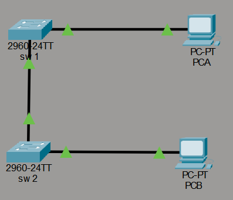


---

### Configuración de los switches

#### a) Asignación de nombre y contraseñas

```bash
enable
configure terminal
hostname sw1
enable secret trabajopractico4
line console 0
 password consolatp4
 login
exit
line vty 0 15
 password remototp4
 login
exit
service password-encryption
write memory
```

Configura el nombre del dispositivo y contraseñas para el acceso local y remoto, protegiéndolas con encriptación.

---

#### b) Creación de VLANs e IP de gestión

```bash
vlan 10
 name Laboratorio
vlan 20
 name Bar
vlan 99
 name Management
!
interface vlan 99
 ip address 192.168.99.11 255.255.255.0
 no shutdown
exit
```

Se configuró la **VLAN 99** como VLAN de administración, permitiendo la gestión remota del switch.

---

#### c) Desactivación de puertos no utilizados

```bash
interface range fastethernet0/2 - 5 , fastethernet0/7 - 24 , gigabitethernet0/1 - 2
shutdown
end
```

Desactivar puertos inactivos mejora la seguridad física y lógica del switch.

---

#### d) Asignación de puertos a VLANs

**SW1 (PC-A)**  
```bash
interface fastethernet0/6
 switchport mode access
 switchport access vlan 10
```

**SW2 (PC-B)**  
```bash
interface fastethernet0/6
 switchport mode access
 switchport access vlan 10
```

---

#### e) Configuración del enlace trunk

```bash
interface fastethernet0/1
 switchport mode trunk
 switchport trunk allowed vlan 1,10,20,99
 no shutdown
```

Permite el transporte simultáneo de tráfico de varias VLANs entre switches.

---

#### f) Configuración de IPs en las PCs

**PC-A**  
```
IP: 192.168.10.3
Mask: 255.255.255.0
Gateway: 192.168.10.1
```

**PC-B**  
```
IP: 192.168.10.4
Mask: 255.255.255.0
Gateway: 192.168.10.1
```


---

### Verificación de conectividad

#### Ping entre PCs (VLAN 10)


La comunicación confirma que las VLANs y enlaces trunk están configurados correctamente.

#### Ping entre switches (VLAN 99)


Verifica la conectividad de la VLAN de administración.

---

### Comprobaciones finales

#### VLANs 10, 20 y 99 activas


#### Fa0/1 trunking VLANs 1,10,20,99


#### VLAN99 up/up con IP asignada


---

### Conclusión — Consigna 2

Se logró implementar y verificar una red LAN segmentada mediante VLANs con una VLAN de administración independiente.  
El uso de contraseñas cifradas, enlaces trunk y desactivación de puertos no utilizados permitió cumplir con todos los objetivos del trabajo, obteniendo una configuración segura, modular y escalable.

---

## Consigna 3 — Simulación de red a bordo de una aeronave

### Descripción general

Se diseñó una topología que representa la red interna de una aeronave, con tres segmentos de usuarios:  
- **Turista:** acceso solo al servidor local.  
- **Business:** acceso al servidor local e Internet.  
- **Administración:** acceso total.  

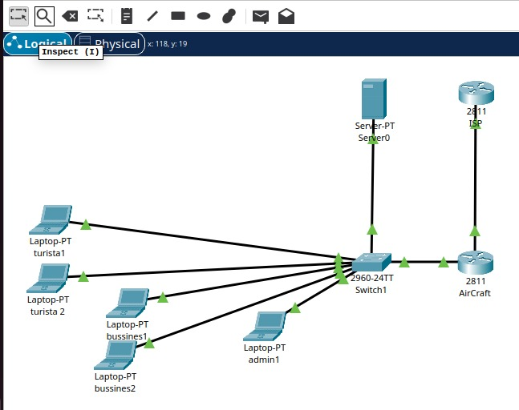

Cada clase fue implementada como una VLAN:

| VLAN | Nombre | Red | Gateway | Acceso |
|------|---------|-----|----------|---------|
| 10 | Turista | 10.10.10.0/24 | 10.10.10.1 | Solo servidor local |
| 20 | Business | 10.10.20.0/24 | 10.10.20.1 | Servidor + Internet |
| 99 | Administración | 10.10.99.0/24 | 10.10.99.1 | Acceso total |

---

### Configuración del switch

Se crearon las VLANs y se asignaron los puertos:

| VLAN | Puertos |
|------|----------|
| 10 (Turista) | f0/2, f0/3 |
| 20 (Business) | f0/4, f0/5 |
| 99 (Administración) | f0/6 |
| 99 (Server) | f0/7 |

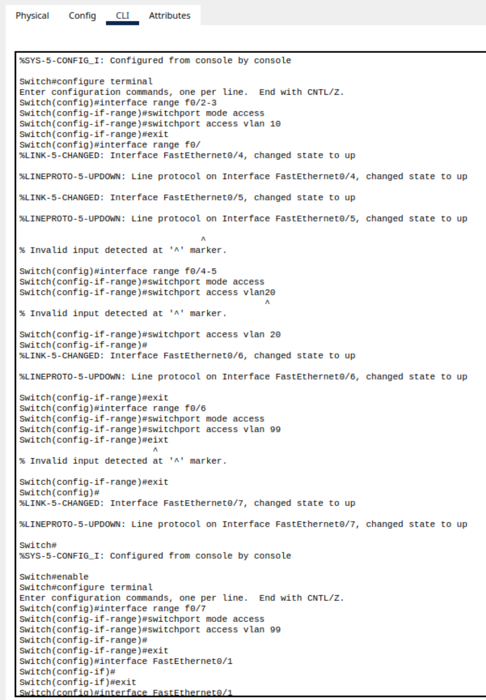

---

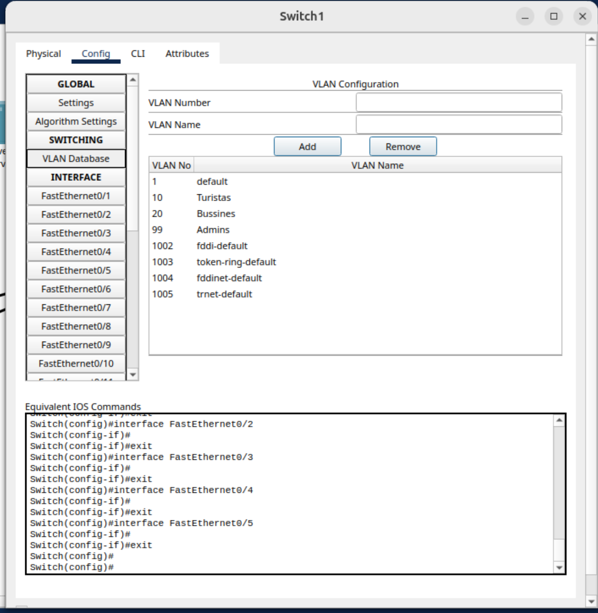

---

### Configuración del router (Aircraft)

Se configuraron subinterfaces, DHCP, NAT y ACLs para controlar el acceso a Internet según la VLAN.

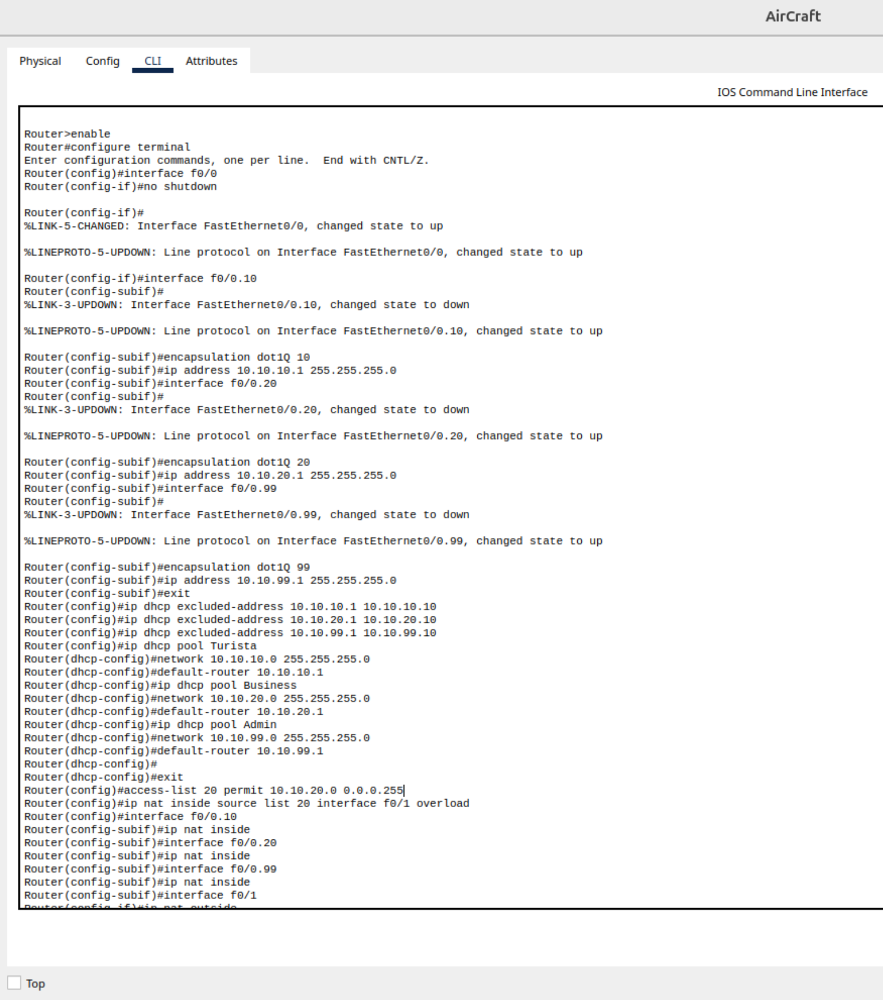

Durante la verificación inicial, los pings desde VLAN10 (Turista) funcionaban hacia Internet por error.  
El problema se debió a una regla de ACL mal aplicada, que fue corregida negando tráfico saliente desde esa red.

---

### Tests realizados

#### Ping al servidor de entretenimiento

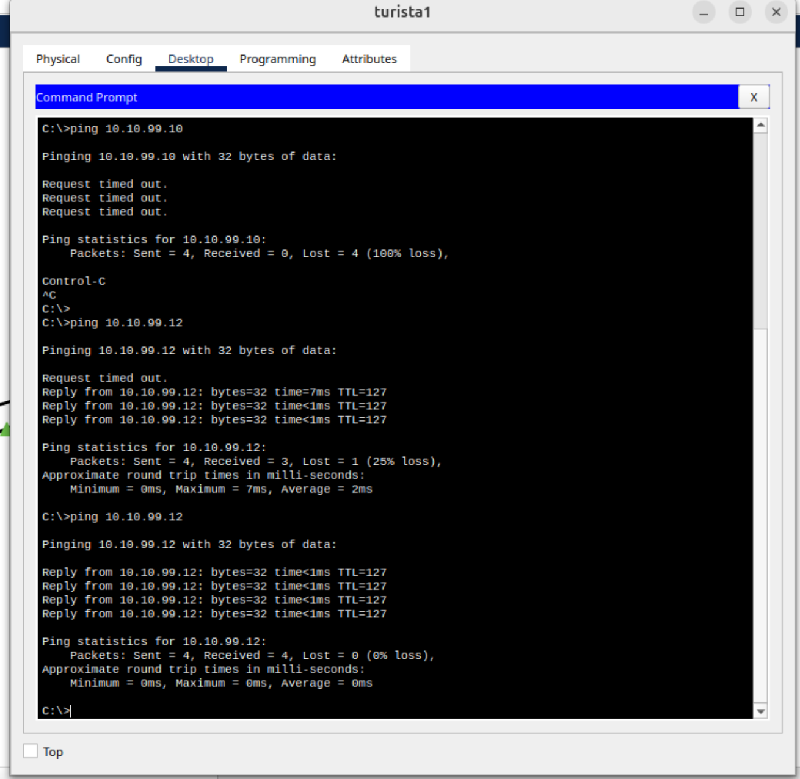

#### Acceso HTTP a servidor local (turista)

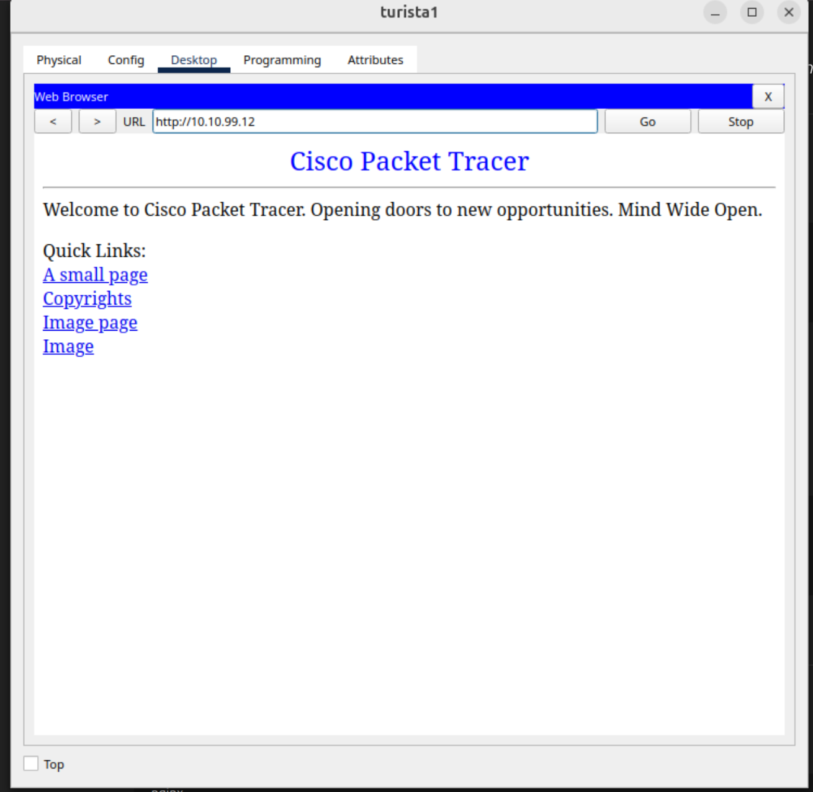

#### Ping a Internet

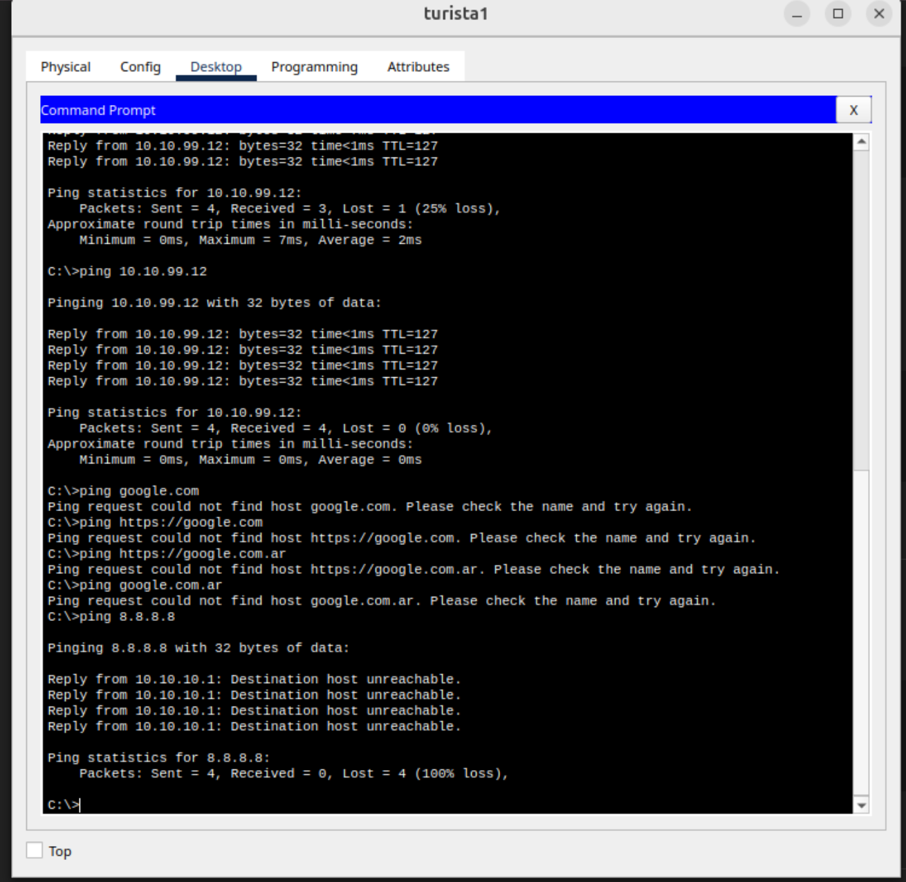

#### Acceso HTTP a servidor local (business)

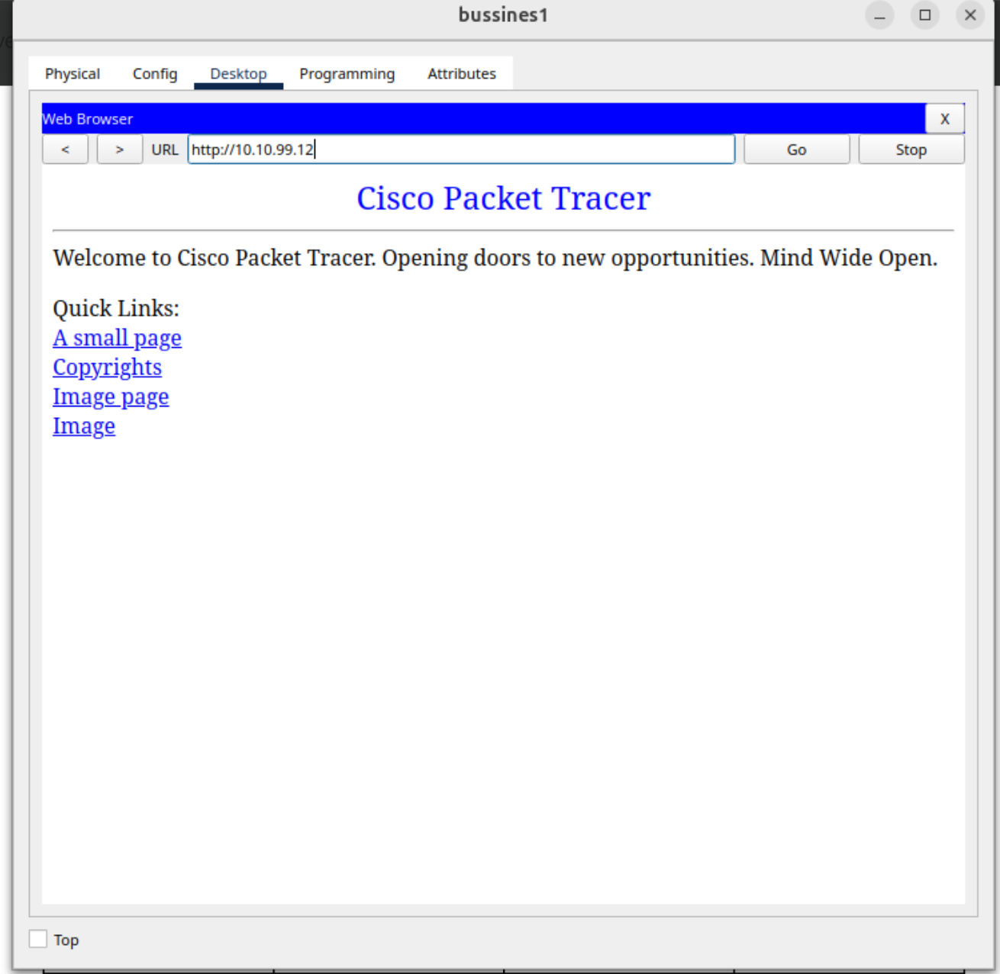

#### Ping a Internet (ej:8.8.8.8)

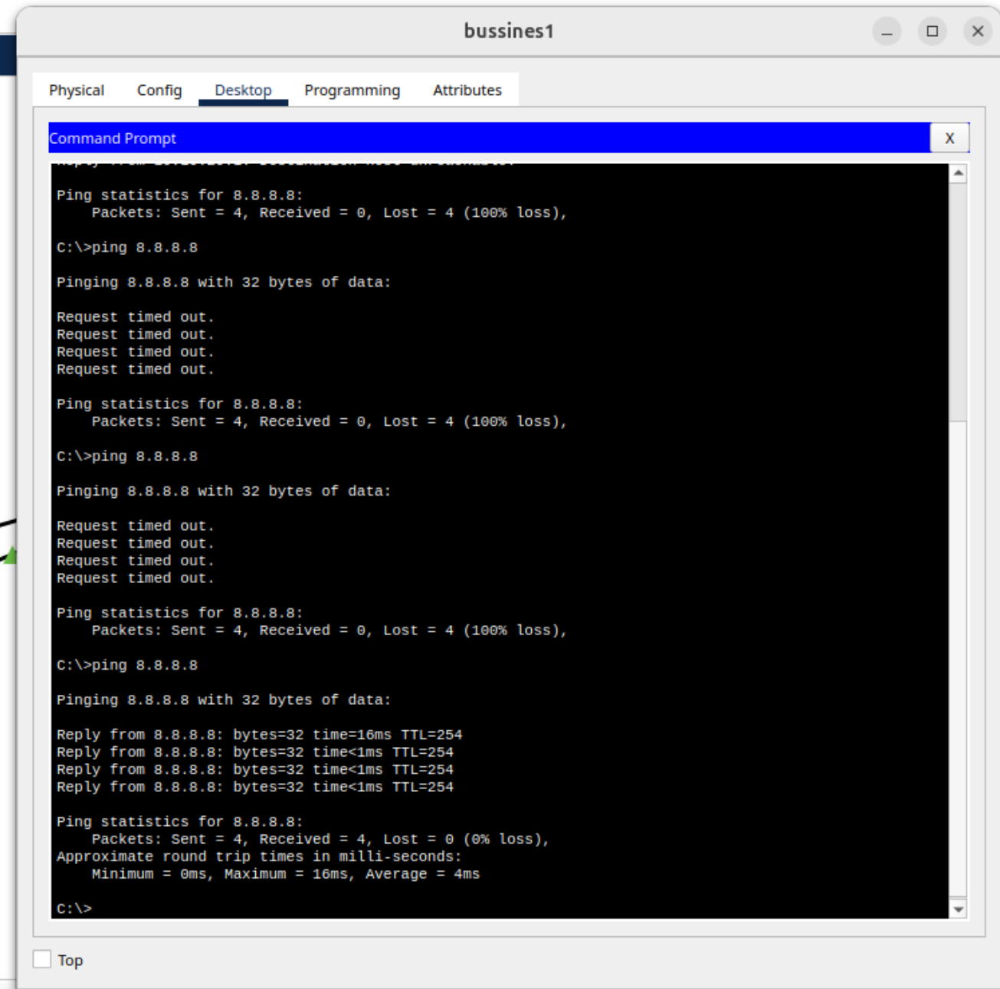

#### Ping entre Admin y todos

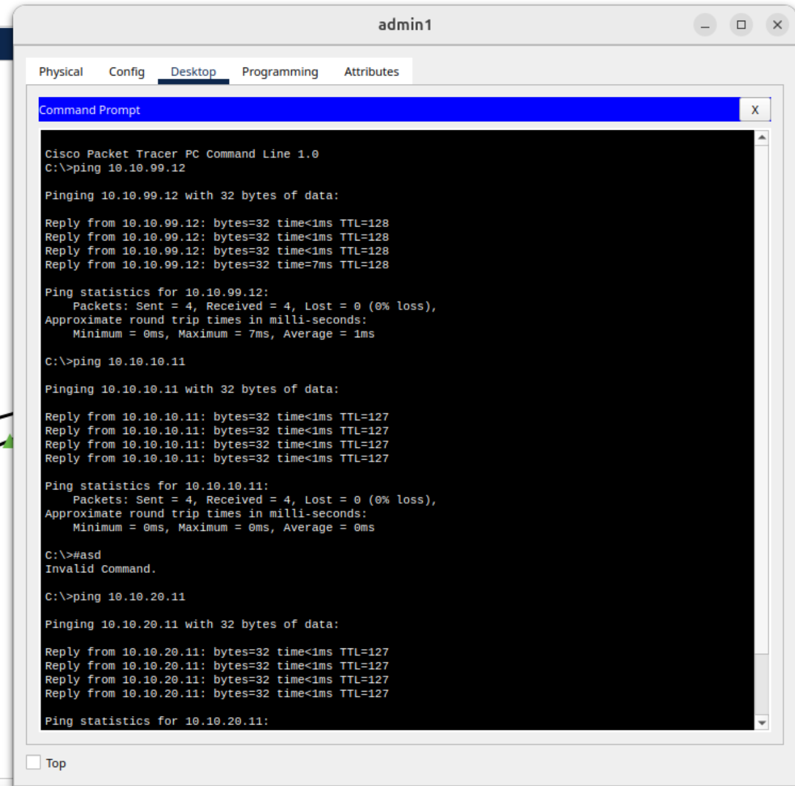

### Conclusión general

Fue divertido y entretenido hacer una implementacion de este ejemplo, sobre todo porque es algo real. Nos permitio entender bastante mejor el funcionamiento de las VLANs y el uso que le podemos dar en la vida cotidiana. 
Nos costo un poco al principio, sobre todo porque en un inicio parecia estar todo bien, pero luego nos dimos cuenta que en algun punto le dimos acceso a internet a los turistas por error. Rastrear el error nos llevo su tiempo, pero pudimos encontrarlo y corregirlo.

---

**Fin del Informe — Trabajo Práctico N°4**
