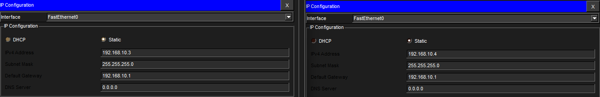
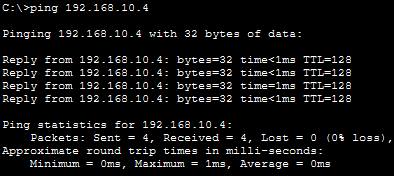
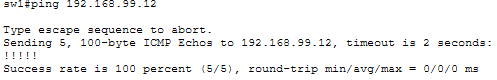
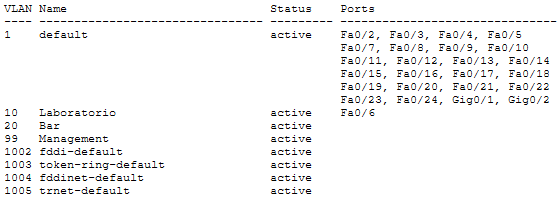
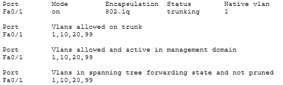

# TRABAJO PRÁCTICO N°3

  
## Universidad Nacional de Córdoba

**Carrera:** Ingeniería en Computación

**Cátedra:** Comunicaciones de Datos

**Docentes:** Santiago M. Henn — Facundo Oliva Cuneo

**Fecha de entrega:** 22/09/2025

---

## Integrantes (Grupo *Latency Killers*)

  

-  **Dante Augsburger**

📧 *dante.augsburger@mi.unc.edu.ar*

-  **Martino Fioramonti**

📧 *martino.fioramonti@mi.unc.edu.ar*

-  **Tadeo Antonino**

📧 *tadeo.antonino@mi.unc.edu.ar*

-  **Ignacio Quintana**

📧 *ignacio.agustin.quintana@mi.unc.edu.ar*

---


## Resumen

HACER RESUMEN

Palabras clave:

---


## Introducción

HACER INTRO 

---


## Consigna 1

## Primera Parte: Capas de Acceso en Redes Locales, Protocolos y Fundamentos

## 1) Alcance de Redes y Virtualización

### a) Clasificación de las redes según su alcance

Las redes se clasifican según su **cobertura geográfica** y **alcance físico**.  
A continuación se detallan los principales tipos:

| Tipo de red | Acrónimo | Alcance aproximado | Características principales |
|--------------|-----------|--------------------|------------------------------|
| **Personal Area Network** | **PAN** | Hasta unos pocos metros | Conecta dispositivos personales (celular, auriculares Bluetooth, smartwatch). Baja potencia y corto alcance. |
| **Local Area Network** | **LAN** | Hasta 1 km | Red de área local. Conecta computadoras y dispositivos en una misma ubicación (hogar, oficina, escuela). Alta velocidad y bajo retardo. |
| **Metropolitan Area Network** | **MAN** | Hasta decenas de km | Interconecta varias LAN dentro de una ciudad o campus. Usada por proveedores o instituciones grandes. |
| **Wide Area Network** | **WAN** | De cientos a miles de km | Conecta redes a nivel nacional o internacional (por ejemplo, Internet). Utiliza enlaces de larga distancia (fibra óptica, satélite, etc.). |
| **Storage Area Network** | **SAN** | Variable (LAN o mayor) | Red dedicada al almacenamiento de datos. Alta velocidad y baja latencia para servidores. |
| **Virtual Local Area Network** | **VLAN** | Virtual | Subdivisión lógica dentro de una LAN física. Aísla el tráfico de distintos grupos sin requerir hardware adicional. |

📘 **En la figura correspondiente:**  
PAN → más chico · LAN → intermedio · MAN → regional · WAN → más grande

---

### b) ¿Qué es una VLAN? ¿Cómo se clasifican?

Una **VLAN (Virtual Local Area Network)** es una **red local virtual** que permite **dividir lógicamente una red física** en varios segmentos independientes.  
Cada VLAN funciona como si fuera una red separada, aunque los dispositivos estén conectados al mismo switch físico.

**Ventajas principales:**
- Segmentación del tráfico (mejor rendimiento).  
- Mayor seguridad (aislamiento entre grupos).  
- Administración flexible (sin recablear físicamente).

**Clasificación de las VLANs:**

| Tipo de VLAN | Descripción |
|---------------|-------------|
| **VLAN por puerto (estática)** | Se asigna manualmente cada puerto del switch a una VLAN. Es la más común. |
| **VLAN dinámica** | Los puertos se asignan automáticamente según la dirección MAC, usuario o protocolo, usando un servidor VMPS. |
| **VLAN por protocolo** | Se agrupan los dispositivos según el protocolo de capa 3 utilizado (por ejemplo, IPv4, IPv6, IPX). |
| **VLAN por dirección MAC** | Se asignan dispositivos a VLANs según su dirección física (MAC). |

---

### c) Protocolo IEEE 802.1Q

El estándar **IEEE 802.1Q** define el **mecanismo de etiquetado (tagging)** que permite identificar a qué VLAN pertenece cada trama Ethernet, es decir, IEEE 802.1Q define cómo se marcan las tramas para mantener la separación lógica de VLANs dentro de una misma infraestructura física.  
Esto permite que múltiples VLANs viajen sobre un **único enlace físico** (por ejemplo, entre dos switches o entre un switch y un router).

**Características principales:**
- Añade una **etiqueta de 4 bytes** dentro de la trama Ethernet original.  
- Esta etiqueta contiene el **VLAN ID (VID)**, que identifica la VLAN (valor entre 1 y 4094).  
- Permite el **trunking**, es decir, el transporte simultáneo de varias VLANs por un mismo enlace.


---

### d) ¿Qué es el *Tagging*?

El **Tagging** es el proceso mediante el cual se **inserta la etiqueta 802.1Q** en la trama Ethernet para identificar su VLAN de origen.

- En un **enlace troncal (trunk)**, el switch **etiqueta (tag)** las tramas salientes con el **VLAN ID** para que el dispositivo receptor sepa a qué VLAN pertenece.  
- En los **enlaces de acceso (access ports)**, las tramas **no van etiquetadas**, porque solo pertenecen a una VLAN.

---

## 2) Implementación de la topología y configuración de VLANs en Packet Tracer

### Objetivo general

Implementar una red LAN compuesta por dos switches y dos computadoras, aplicando la creación de VLANs, configuración de puertos, asignación de IPs de gestión, contraseñas, encriptación y enlaces trunk.
Finalmente, verificar la conectividad entre hosts de la misma VLAN y la correcta segmentación del tráfico.

---

### Topología general

La topología implementada en **Cisco Packet Tracer** está formada por:

| Dispositivo | IP de gestión | VLAN | Descripción |
|--------------|---------------|-------|--------------|
| **SW1** | 192.168.99.11 | 99 (Management) | Switch principal |
| **SW2** | 192.168.99.12 | 99 (Management) | Switch secundario |
| **PC-A** | 192.168.10.3 | 10 (Laboratorio) | Host conectado a SW1 |
| **PC-B** | 192.168.10.4 | 10 (Laboratorio) | Host conectado a SW2 |

**Conexiones físicas (Copper Straight-Through):**

*   SW1 Fa0/1 ↔ SW2 Fa0/1 → enlace _trunk_
    
*   SW1 Fa0/6 ↔ PC-A Fa0
    
*   SW2 Fa0/6 ↔ PC-B Fa0
    

Topología final en Packet Tracer funcionando.

---

### Configuración de los switches

#### 🔹 a) Asignación de nombre y contraseñas

```bash
enable
configure terminal
hostname sw1
enable secret trabajopractico4
line console 0
 password consolatp4
 login
exit
line vty 0 15
 password remototp4
 login
exit
service password-encryption
write memory
```

Estas configuraciones establecen los nombres de los switches y contraseñas seguras para el acceso local (console), remoto (vty) y privilegiado (enable secret).El comando service password-encryption protege las contraseñas en el archivo de configuración.

---

#### 🔹 b) Configuración de las VLANs e IP de gestión

```bash
vlan 10
 name Laboratorio
vlan 20
 name Bar
vlan 99
 name Management
!
interface vlan 99
 ip address 192.168.99.11 255.255.255.0
 no shutdown
exit
```

Se crearon las VLANs requeridas y se configuró una **VLAN de administración (99)** para asignar la IP de gestión a los switches.

---

#### 🔹 c) Desactivación de puertos no utilizados

```bash
interface range fastethernet0/2 - 5 , fastethernet0/7 - 24 , gigabitethernet0/1 - 2
shutdown
end
```

Desactivar puertos no utilizados mejora la seguridad física y lógica del switch, evitando conexiones no autorizadas.

---

#### 🔹 d) Asignación de puertos a VLANs

En **SW1 (PC-A)**:

```bash
interface fastethernet0/6
 switchport mode access
 switchport access vlan 10
```

En **SW2 (PC-B)**:

```bash
interface fastethernet0/6
 switchport mode access
 switchport access vlan 10
```

Los puertos conectados a las PCs se configuraron como _access ports_, pertenecientes a la VLAN 10 (“Laboratorio”), para permitir su comunicación interna.

---

#### 🔹 e) Configuración del enlace trunk entre los switches

```bash
interface fastethernet0/1
 switchport mode trunk
 switchport trunk allowed vlan 1,10,20,99
 no shutdown
```

El enlace _trunk_ entre sw1 y sw2 permite transportar simultáneamente el tráfico de múltiples VLANs, manteniendo la segmentación lógica a través del enlace físico compartido.

---

#### 🔹 f) Configuración de IPs en las PCs

**PC-A**

```bash
IP Address: 192.168.10.3
Subnet Mask: 255.255.255.0
Default Gateway: 192.168.10.1
```

**PC-B**

```bash
IP Address: 192.168.10.4
Subnet Mask: 255.255.255.0
Default Gateway: 192.168.10.1
```



---

### Verificación y pruebas

#### Ping entre PCs (VLAN 10)



Terminal de PC-A mostrando ping exitoso a PC-B.

La comunicación entre las PCs confirma que las VLANs están correctamente configuradas, los enlaces _trunk_ activos y la segmentación lógica funcionando.

#### Ping entre switches (VLAN 99)


CLI mostrando ping exitoso entre switches.

Verifica la conectividad en la VLAN de administración (Management), garantizando acceso remoto y monitoreo centralizado.

---

### Comprobaciones finales

#### VLANs 10, 20 y 99 activas


#### Fa0/1 trunking VLANs 1,10,20,99


#### VLAN99 up/up con IP asignada


--- 
### Conclusión Consigna 2

Se logró implementar y verificar una red LAN segmentada mediante VLANs, con administración separada y comunicación funcional entre hosts del mismo segmento.El uso de **VLANs, contraseñas encriptadas, trunking y desactivación de puertos no usados** permitió cumplir con todos los objetivos del trabajo práctico, demostrando una configuración segura, modular y escalable.


## 3)
Primero configure la topologia en el packet trace, puse 2 notebooks para clase bussines y para turistas, y una para administracion.
Todas estaban conectadas a un switch,
Turistas => f0/2 y f0/3
Bussines => f0/4 y f0/5
Administracion => f0/6
Server => f0/7

Luego en base a esas conexiones primero configure el switch. Cree las vlans correspondientes:
10 => Turistas
20 => Bussines
99 => Admnis
Y luego asigne los puertos a cada vlans segun correspondia 

Turistas => f0/2 y f0/3 => VLAN 10
Bussines => f0/4 y f0/5 => VLAN 20
Administracion => f0/6 => VLAN 99
Server => f0/7 VLAN 99

Luego pase a configurar el router, donde segui los siguientes comandos que estan en las imagenes. Son los mismo que nos daba la actividad practicamente

Verificamos que el DHCP este bien configurado, para ello me fui a cada PC, en el apartado de IP Configuration y en el DHCP vi que se le asigno la IP con el rango correspondiente a cada PC. En las imagenes IP_clase, se ve como esta asignada cada una


TEST_5: Al principio no funcionaba el ping, porque no habia configurado que el isp devolviera algo simulado cuando se hiciera ping.
Cuando lo configure deje mal algo que hizo que turistas tuviera acceso a internet. tuve que volver a configurar la parte de denegar acceso a internet en el router aircraft a la vlan10 (turistas)


Conclusion:
Fue divertido y entretenido hacer una implementacion de este ejemplo, sobre todo porque es algo real. Nos permitio entender bastante mejor el funcionamiento de las VLANs y el uso que le podemos dar en la vida cotidiana. 
Nos costo un poco al principio, sobre todo porque en un inicio parecia estar todo bien, pero luego nos dimos cuenta que en algun punto le dimos acceso a internet a los turistas por error. Rastrear el error nos llevo su tiempo, pero pudimos encontrarlo.
