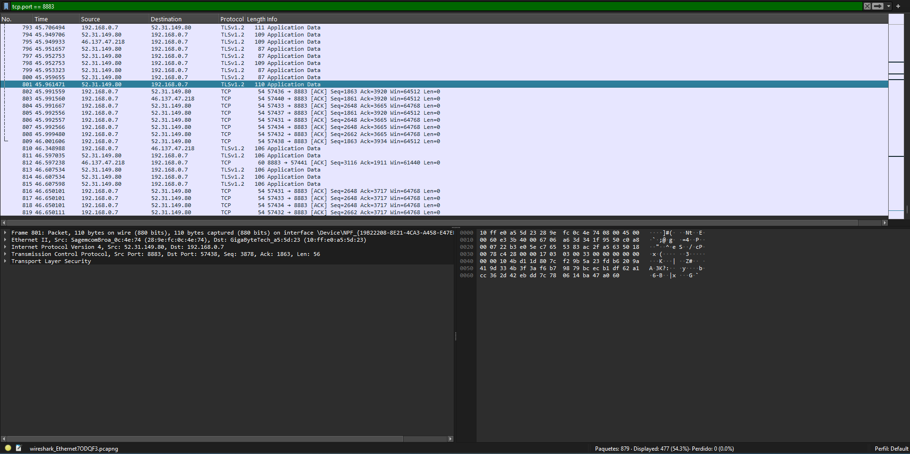
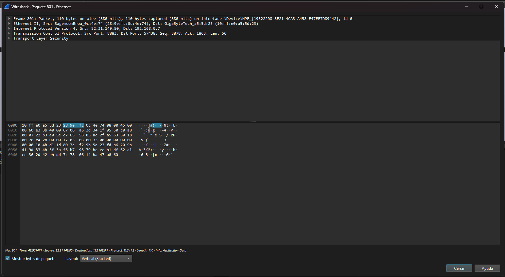

# TRABAJO PRÁCTICO N°5


# Simulación de una Red Local utilizando MQTT

## Universidad Nacional de Córdoba

**Carrera:** Ingeniería en Computación  
**Cátedra:** Comunicaciones de Datos  
**Docentes:** Santiago M. Henn — Facundo Oliva Cuneo  
**Fecha de entrega:** 03/11/2025  

---

## Integrantes (Grupo *Latency Killers*)

- **Dante Augsburger** — *dante.augsburger@mi.unc.edu.ar*  
- **Martino Fioramonti** — *martino.fioramonti@mi.unc.edu.ar*  
- **Tadeo Antonino** — *tadeo.antonino@mi.unc.edu.ar*  
- **Ignacio Quintana** — *ignacio.agustin.quintana@mi.unc.edu.ar*  

-----

## Resumen

El presente trabajo práctico tiene como objetivo comprender e implementar el protocolo de mensajería MQTT (Message Queuing Telemetry Transport) en un entorno de red simulado. Se diferencia el modelo de comunicación Publish/Subscribe del tradicional Cliente-Servidor mediante el despliegue de una arquitectura IoT. Para ello, se configuró un Broker en la nube utilizando HiveMQ y se desarrollaron clientes simulados (sensores y gateways) utilizando Node.js. Se experimentó con tópicos jerárquicos, el uso de comodines para broadcasting y niveles de QoS. Finalmente, se realizó un análisis de tráfico de red mediante un sniffer (Wireshark) para verificar los protocolos de la capa de transporte y seguridad, confirmando la integridad y confidencialidad de los datos transmitidos.

**Palabras clave**: *MQTT, IoT, Pub/Sub, Broker, Node.js, Sniffer, TCP/IP.*

-----

## Introducción

En el contexto actual del Internet de las cosas (IoT), la eficiencia en la transmisión de datos es crítica. Los modelos tradicionales de comunicación HTTP a menudo resultan pesados para dispositivos con recursos limitados o redes con ancho de banda restringido. Aquí es donde el protocolo MQTT cobra relevancia como un estándar ligero y eficaz.

El objetivo de este laboratorio es simular una red local de dispositivos interconectados mediante un intermediario central denominado Broker[cite: 7]. A diferencia del modelo cliente-servidor, donde el cliente solicita información directamente al servidor, MQTT utiliza el patrón de diseño **Publish/Subscribe (Pub/Sub)**. En este modelo, los clientes (publicadores) envían mensajes a un "tópico" específico, y otros clientes (suscriptores) reciben dichos mensajes sin necesidad de conocer la identidad o dirección IP del emisor.

Durante el desarrollo, se utilizarán herramientas como HiveMQ Cloud para la gestión del Broker, Node.js para la lógica de los clientes, y Wireshark para el análisis de paquetes en la capa de transporte y seguridad.

-----

# Marco teórico / Modelo / Metodología

## Protocolo MQTT y Patrón Pub/Sub

MQTT es un protocolo de mensajería basado en estándares abiertos, diseñado para ser ligero y eficiente.

  * **Ventajas:** Bajo consumo de ancho de banda, ideal para redes inestables, y bajo consumo de energía en los dispositivos.
  * **Desventajas:** Dependencia de un nodo central (Broker) y menor capacidad para transferir archivos grandes (streaming) en comparación con HTTP.
  * **Patrón Pub/Sub:** Permite el desacoplamiento total entre el productor y el consumidor de la información. El Broker actúa como "oficina de correos", filtrando y distribuyendo los mensajes a los clientes suscritos a temas de interés.

## Configuración del Entorno

Para la implementación de la red, se utilizó **HiveMQ Cloud** como servicio de Broker. Los parámetros de conexión establecidos fueron:

  * **URL del Cluster:** `8c73411f8fe14bb2968b57754537a966.s1.eu.hivemq.cloud`
  * **Puerto:** 8883 (Conexión segura TLS)
  * **Protocolo:** TCP/IP

## Implementación en Node.js

Se desarrolló una estructura de proyecto en JavaScript (Node.js) para simular los nodos de la red. La lógica se dividió en:

1.  **Sensores (Publicadores):** Scripts que generan datos aleatorios (temperatura/humedad) y los publican en tópicos jerárquicos como `lan/sala1/sensor/temp`. [cite\_start]Se implementó un ciclo de publicación con intervalos superiores a 500ms.
2.  **Gateway (Suscriptor Central):** Un cliente suscrito mediante comodines (`lan/+/sensor/+`) encargado de recolectar toda la información de las salas y almacenarla localmente.
3.  **Broadcasting:** Se configuró la suscripción al tópico `lan/broadcast/#` para recibir comandos globales, permitiendo enviar señales de "apagado" o "inicio" a todos los nodos simultáneamente.

<!-- end list -->

```javascript
// Ejemplo de estructura de tópico implementada
const topic = "lan/sala1/sensor/temp";
client.publish(topic, "25.5");
```

-----

## Resultados

Se logró establecer conexión exitosa entre los dispositivos simulados y el Broker en la nube. A continuación se detallan los hallazgos del análisis de tráfico.

### Análisis de Paquetes (Sniffer)

### Análisis de Paquetes (Sniffer)

Se utilizó **Wireshark** para capturar el tráfico de red generado durante la simulación. Se aplicó el filtro `tcp.port == 8883` para aislar la comunicación con el clúster de HiveMQ.


*Figura 1: Tráfico TCP/TLS capturado en el puerto 8883.*

A continuación, se detalla el análisis de un paquete específico de datos de aplicación:


*Figura 2: Desglose de capas OSI mostrando la encriptación TLS.*

Como se observa en la **Figura 1** (basada en la captura realizada), el análisis de la composición del paquete revela:

| Capa del Modelo OSI | Protocolo Detectado | Observación |
| ----------- | ----------- | ----------- |
| **Transporte** | **TCP** (Transmission Control Protocol) | Se verifica el uso de TCP (puerto origen 8883), garantizando la entrega ordenada de paquetes. |
| **Sesión/Presentación** | **TLS** (Transport Layer Security) | El payload del mensaje aparece como "Encrypted Application Data", lo que confirma que el contenido es ilegible para terceros. |

La inspección del paquete confirma que, aunque es posible ver las cabeceras TCP e IP, el contenido del mensaje MQTT (el tópico y el valor de temperatura) está cifrado, garantizando la **Confidencialidad** de la información.

-----

## Discusión y conclusiones

A partir de la implementación y los resultados obtenidos, se responden los interrogantes planteados sobre la arquitectura:

1.  **Protocolos de Transporte:** La actividad se desarrolla sobre **TCP**. MQTT requiere una conexión fiable y ordenada, por lo que no utiliza UDP.
2.  **Seguridad (CIA):**
      * **Confidencialidad:** Garantizada por el uso de TLS (puerto 8883), protegiendo los datos de escuchas no autorizadas.
      * **Integridad:** Asegurada por el protocolo TLS, que evita la modificación de datos en tránsito.
      * **Disponibilidad:** Depende críticamente del servicio en la nube de HiveMQ y la conexión a internet.
3.  **Rol de QoS:** Los niveles de Calidad de Servicio (0, 1, 2) permiten ajustar el equilibrio entre la garantía de entrega y la latencia de la red. Un QoS más alto asegura la recepción pero aumenta el tráfico de control.
4.  **Pub/Sub vs Cliente-Servidor:** El modelo Pub/Sub ofrece mayor escalabilidad y desacoplamiento. Permite agregar nuevos sensores o gateways sin reconfigurar los dispositivos existentes, algo complejo en arquitecturas punto a punto.
5.  **Limitaciones y Riesgos:** La principal limitación de MQTT en esta configuración es la latencia introducida por el viaje de ida y vuelta a la nube (Round Trip Time) para dispositivos que están físicamente en la misma LAN. Además, depender de un Broker Central introduce un **punto único de fallo**; si el broker cae, toda la comunicación de la red se detiene.

En conclusión, la simulación demostró que MQTT es una solución robusta para IoT, facilitando la interoperabilidad entre dispositivos heterogéneos mediante una estructura de tópicos lógica y segura.

## Referencias

[1] Cátedra de Comunicaciones de Datos. (2025). *Trabajo Práctico N°5: Simulación de una Red Local utilizando MQTT*. Universidad Nacional de Córdoba.

[2] HiveMQ. (s.f.). *HiveMQ Cloud Documentation*. Recuperado de [https://www.hivemq.com/](https://www.hivemq.com/)

[3] MQTT.org. (s.f.). *The Standard for IoT Messaging*. Recuperado de [https://mqtt.org/](https://mqtt.org/)

[4] Wireshark Foundation. (s.f.). *Wireshark User's Guide*. Recuperado de [https://www.wireshark.org/](https://www.wireshark.org/)